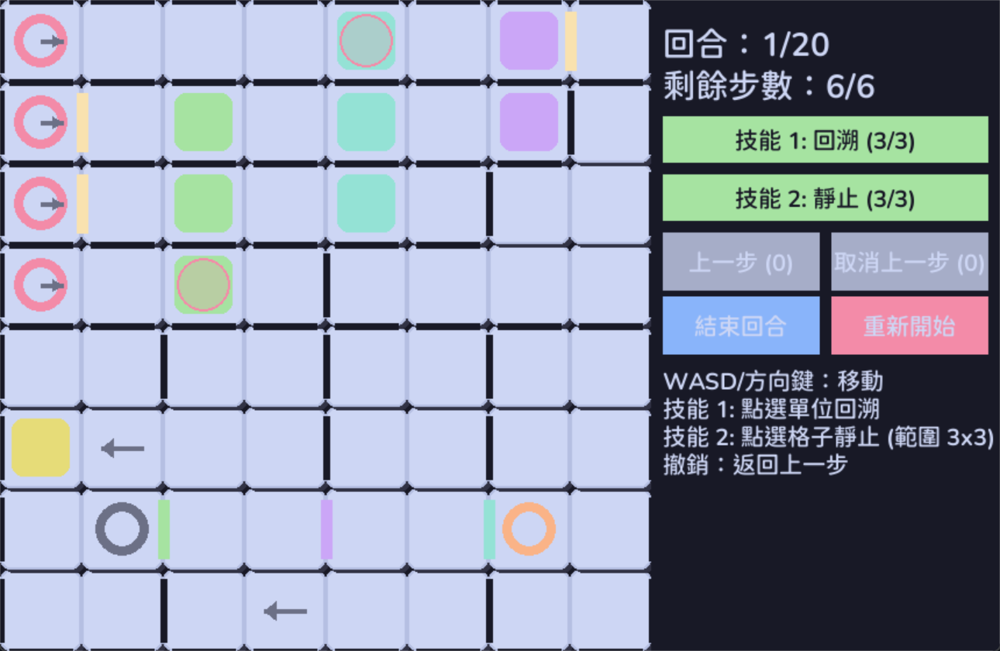

<p align="center">
  <h1 align="center">銀與血 - 詭秘航路</h1>
</p>

<p align="center">
<!-- 你可以在這裡放置專案的徽章或下載連結 -->
</p>





## 通關影片

https://github.com/user-attachments/assets/6cfef850-9152-400d-8dde-b62d9f0f3710

這是「銀與血 - 詭秘航路」其中一關：軍械號 II - 四重奏的模擬小遊戲，使用 Python + pygame 製作。
~~本來想請 AI 來幫我破關，結果自己突然就過關了~~

## 遊戲特色
- 預測敵人的下一步位置

## 執行方式

### 方式一：直接執行 Python 原始碼
1. 安裝 Python 3.8 以上版本。
2. 安裝 pygame：
   ```bash
   pip install pygame
   ```
3. 確認 `fonts/ChironGoRoundTC-Medium.ttf` 字體檔案已放在正確路徑。
4. 執行主程式：
   ```bash
   python game.py
   ```

### 方式二：執行打包後的 EXE
1. 下載或自行打包 `dist/game.exe`。
2. 確認 `fonts` 資料夾與 `game.exe` 同目錄。
3. 直接點擊 `game.exe` 執行遊戲。

#### 打包指令（如需自行打包）
```powershell
pyinstaller --onefile --windowed --add-data "fonts;fonts" game.py
```

## 檔案結構
```
sliver_and_blood/
├── game.py                  # 主程式
├── dist/
│   └── game.exe             # 打包後的執行檔（PyInstaller 產生）
├── fonts/
│   └── ChironGoRoundTC-Medium.ttf  # 遊戲用字體
└── ...
```

## 注意事項
- 若執行時無法顯示中文字，請確認字體檔案存在且路徑正確。
- 若 pygame 無法安裝，請確認 Python 版本與網路連線。
- EXE 版本執行時不會顯示命令提示字元（cmd）視窗。

## 📝 授權

> 你可以在此查看完整授權條款：[LICENSE](LICENSE)

本專案採用 **GNU 通用公共授權條款第 3 版（或更新版本）** 發佈。
你可以自由使用、修改、散布本程式，但必須遵守 GPLv3 條款。

## 聯絡方式
如有問題，請於 GitHub 提 issue 或聯絡作者。
